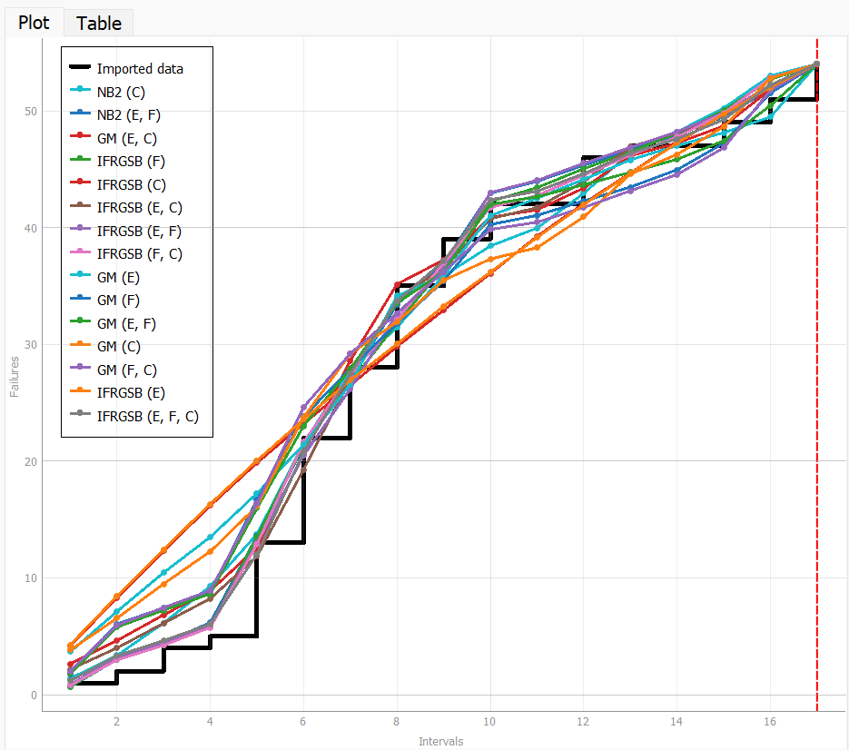
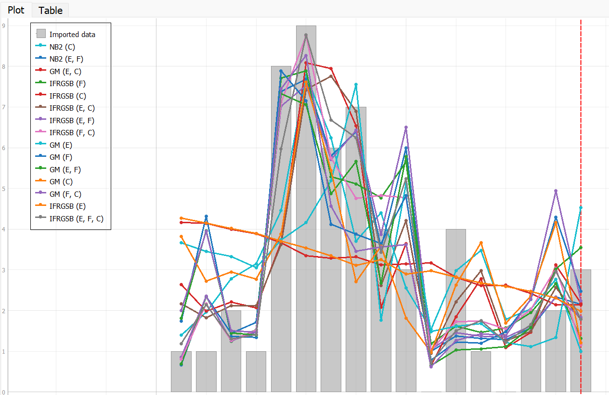
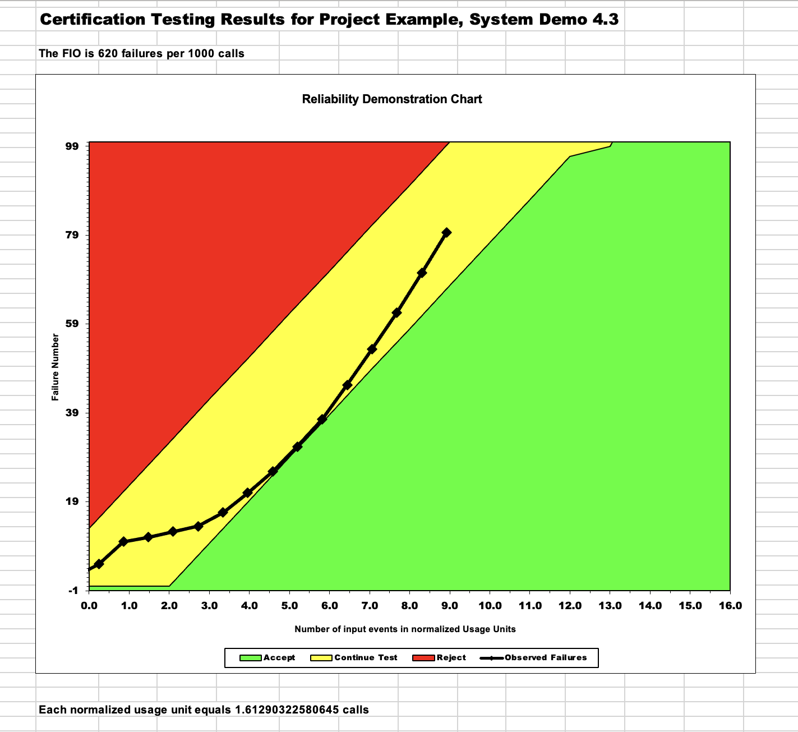
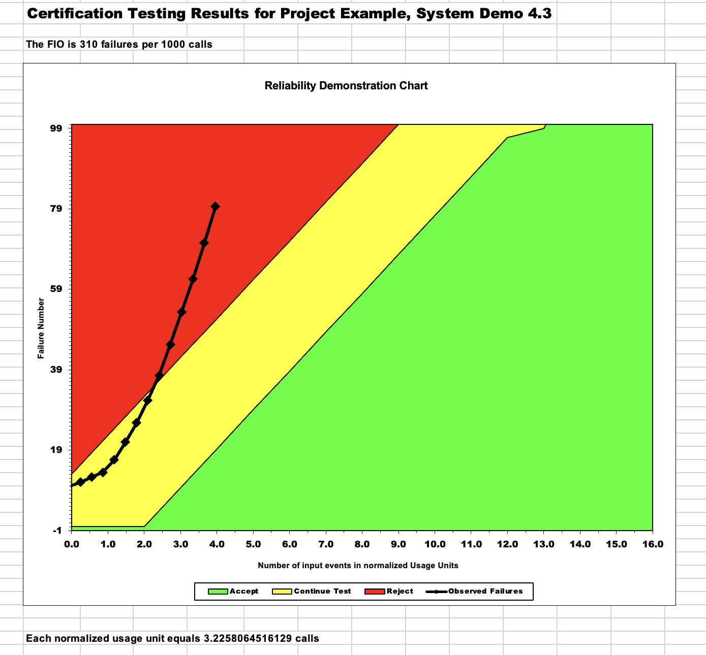
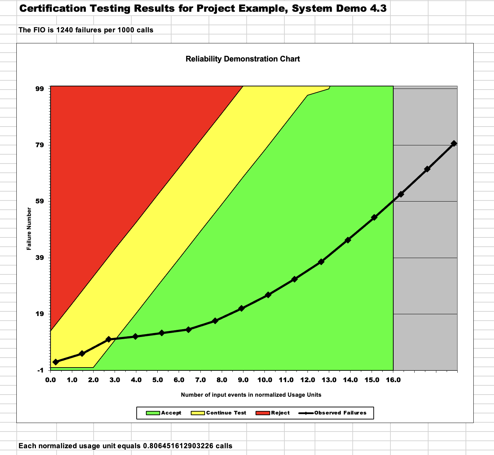

**SENG 637 GROUP 3**

<table>
  <tr>
   <td>
    Sr.
   </td>
   <td>
    Name
   </td>
  </tr>
  <tr>
   <td>
    1.
   </td>
   <td>
    Raiyan Kabir
   </td>
  </tr>
  <tr>
   <td>
    2.
   </td>
   <td>
    Jay Gurjar
   </td>
  </tr>
  <tr>
   <td>
    3.
   </td>
   <td>
    Rahul Jha
   </td>
     <tr>
        <td>
           4.
        </td>
      <td>
         Usman Zia
      </td
    </tr>
      <tr>
         <td>
            5.
         </td>
         <td>
            Tyler Shenassa
         </td>
      </tr>
  </tr>
</table>

# Introduction

The lab aimed to familiarize us with reliability assessment techniques such as C-SFRAT and the Reliability Demonstration Chart, as well as using Excel to analyze failure data. We will also have the opportunity to learn about reliability growth testing, which helps identify changes in a product's reliability over time. By examining failure data, we will determine how to prevent future failures. Through this lab, integration test data will be analyzed using both reliability growth testing and the Reliability Demonstration Chart, which allowed us to create models and plots for calculating MTTF, failure intensity, and software reliability. Also, each section of this lab serves the purpose of enhancing our understanding of reliability analysis and measurement, and we hope to learn how reliability certification can determine software quality. Ultimately, the lab will help us in recognizing when testing is necessary during software development.

# Assessment Using Reliability Growth Testing 

The geometric (G) and IFR generalized Salvia & Bollinger (IFRGSB) models were used to graph the data as these were the only hazard functions that were fully functioning when using our chosen dataset. When comparing the two, the prediction of model G fit closer to the failure data (which had a somewhat S shape) while model IFRGSB was more linear overall.

Using Excel, Laplace calculations were done on the failure data to determine the useful range of data to use. From the sheet, around 80% of the data was used, mostly excluding the outer boundaries of the failure data (e.g. failure happening closer to the start and end of the program running, with some in between).

Graphs for the failure rate and reliability of the SUT can be seen below:

Generally, if we see that the SUT is below or at the threshold of the target failure rate, the system is assumed to be functioning and operating well and will not require any troubleshooting within the codebase. However, if it is higher, it may be determined that the system will require further action on bug-fixing before deployment and to avoid further failures.

Advantages on RGT:
- helps determine reliability issues by using both failure count and inter-failure times
- helps determine the overall reliability of the system before deployment to users

Disadvantages on RGT:
- time and cost-expensive
- requires a large and accurate amount of data to be useful

# Assessment Using Reliability Demonstration Chart 
MTTFmin:

Half MTTFmin:

Twice MTTFmin:

Explaining and justificating how you decide the MTTFmin:
To determine the MTTF min using the RDC method, we defined the Failure Intensity Objective (FIO), which is the maximum allowable failure rate for the software. Then we found the point where the RDC curve intersects the FIO line represents the MTTF min for the software. This is the minimum mean time to failure that the software must achieve to meet the required level of reliability. If the RDC curve is above that imaginary FIO line at all times, then the software has achieved the required level of reliability and is considered reliable enough for use. If the RDC curve dips below the FIO line at any point, then the software has failed to meet the required level of reliability, and corrective actions must be taken to improve the software's reliability.

Advantages of RDC testing:
- The primary advantage of RDC testing is that it provides confirmation that the software has achieved the required level of reliability, as specified by the Failure Intensity Objective (FIO).
- RDC testing provides an objective and standardized way to measure the software's reliability, which can be compared across different software products and versions.
- A cost-effective way to verify the reliability of the software before it is released, as it requires fewer resources than other forms of testing.

Disadvantages of RDC testing:
- RDC testing is typically performed towards the end of the software development process, which means that any defects or issues that are discovered may be difficult or expensive to fix.
- Altogether this method provides limited feedback on the root causes of defects and issues, making it more difficult to eventually improve the software's reliability.
- RDC testing is most applicable to software that is expected to have low failure rates

# Comparison of Results
In the two methods which we collectively used to obtain an estimated MTTF for better reliability knowledge, we found results that were very similar. Both methods brought us to roughly and reasonably the same result for the MTTF of the system.
The Reliability Demonstration Chart (RDC) is typically performed towards the end of the growth testing period to confirm that the software has achieved a specific reliability level, called the Failure Intensity Objective (FIO). During this stage, the software code is usually frozen to prevent further changes that could affect its reliability.

# Discussion on Similarity and Differences of the Two Techniques

Reliability Growth Analysis and Reliability Demonstration Chart are two system reliability techniques that can provide crucial insights about the Software Under Test (SUT) and its testing. Their similaririties include:

* Reliability Growth Analysis and Reliability Demonstration Chart are system reliability techniques.
* Both techniques rely on inter-failure times and MTTF.
* The same dataset of failures was used as input for both techniques.
* Both techniques were applied to test the same system.

Both Reliability Growth Analysis and Reliability Demonstration Chart interpret the data differently to develop distinct reliability plots for the system. Their differences include:

* Reliability Growth Analysis and Reliability Demonstration Chart interpret data differently to generate reliability plots for the system.
* Reliability Growth Analysis uses failure count and inter-failure times, while RDC only uses inter-failure times.
* Reliability Growth Analysis employs exponential and logarithmic Poisson models to estimate λ/λF ratios and track failure intensity trends.
* RDC uses Discrimination Ratio, Consumer Risk, and Developer Risk to evaluate the acceptability of the SUT.

# How the team work/effort was divided and managed

The team chose to collaborate on the lab project. We began first by installing the required tools. Together, we learned how to operate the tools and decided to use C-SFRAT because it was compatible with most laptops. However, Tyler and Usman were not able to run the software because they both had Macbooks so Jay, Kabir and Rahul worked on Part 1 using C-SFRAT and SRTAT while Tyler and Usman worked on Part 2 using the RDC excel chart. Once all the necessary components were compiled and the graphs were created, the team collaborated to write the report and discuss their individual tools' functionality and results.

# Difficulties encountered, challenges overcome, and lessons learned

This lab was an interesting one, there were challenges encountered such as figuring out how to make the RDC Excel sheet take in more than 16 values, and modifying the data to fit the tools which took several hours. In addition, the SRTAT RDC only showed one failure data point which required assumptions to calculate the MTTFmin. Furthermore, the Reliability Growth Analysis had its own challenges such as CSFRAT being quite slow and the MTTF/MTBF calculation being complicated. It is important to note that while these tools can provide accurate results, they are only a simulation and the SUT needs to be thoroughly tested in reality. The tools cannot always be relied upon as the data is calculated and approximated within each tool, and a high learning curve and background knowledge is required for their functionality and result interpretation.

# Comments/feedback on the lab itself

The setup for the lab and a handful of the tools being used in the lab were found to be slightly problematic. In the sense that some people hand hinderances which slowed down the implementation process. On one hand, some of the issues that arised caused us to slow down and learn how the systems work on a more clear box level in order to solve them. However, it did have a small impact on the effeciency of the team getting the work done for the lab and learning what truly needed to be learned. 
